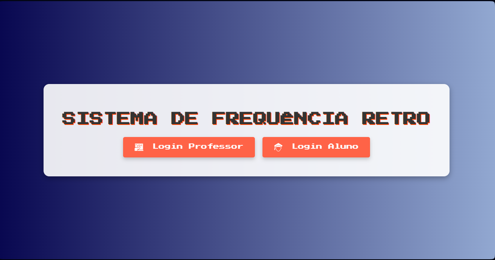
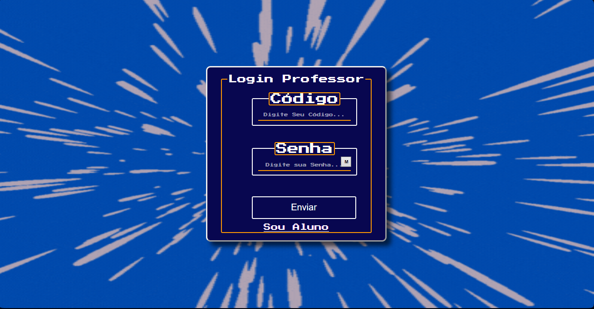
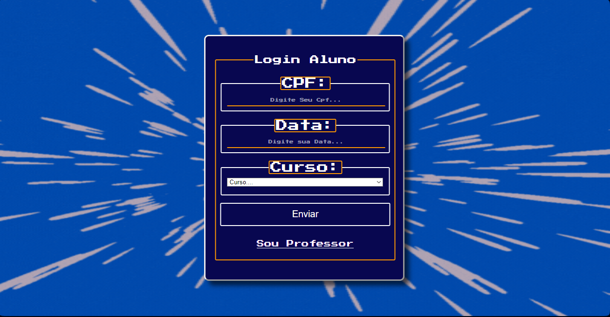
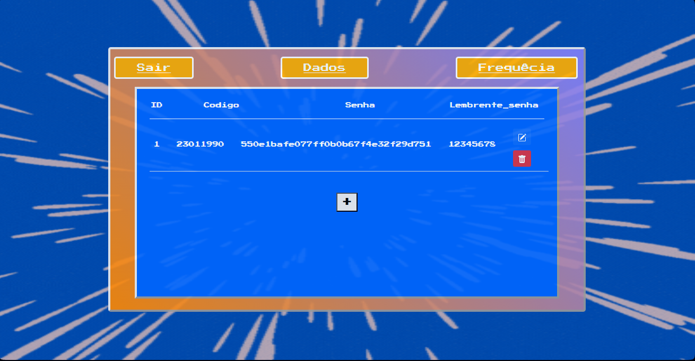
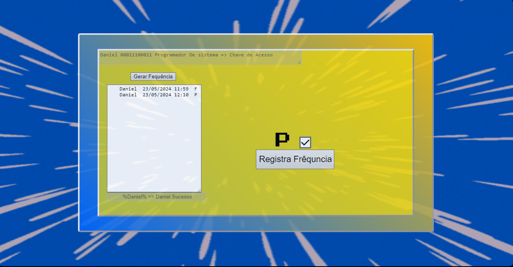

# Sistema de Frequência Retrô




## Descrição

O **Sistema de Frequência Retro** é uma plataforma desenvolvida para gerenciar a presença de alunos e professores de maneira eficiente e intuitiva. Com um design nostálgico e funcionalidade robusta, este sistema remete à estética dos sistemas antigos dos anos 80 e 90, proporcionando uma experiência única.

## Funcionalidades

- Registro de presença 
- Relatórios de Alunos e Professores
- Interface amigável e fácil de usar
- Funcionalidade de pesquisa
- Cadastro de Alunos , Professores
- Marca presença por aluno

## Pré-requisitos

> [!IMPORTANT]  
Antes de começar, você precisará ter as seguintes ferramentas instaladas em sua máquina:

- [Git](https://git-scm.com)
- [PHP](https://www.php.net/)
- [MySQL](https://www.mysql.com/)
- Um servidor web como [XAMPP](https://www.apachefriends.org/index.html) ou [WAMP](http://www.wampserver.com/en/)

## Instalação

1. Clone o repositório para sua máquina local:

```bash
git clone https://github.com/dvizioon/SISTEMA-DE-FREQUENCIA-RETRO.git
```

2. Navegue até o diretório do projeto:

```bash
cd SISTEMA-DE-FREQUENCIA-RETRO
```

> [!CAUTION]
> se você estiver usando um servidor embutido lembre-se de configurar o caminho das ext no php.ini/ para reconhecer as DLLS.

3. Configure seu servidor web para apontar para o diretório do projeto.

4. Importe o banco de dados MySQL:

    - Abra o phpMyAdmin / ou outro SGBD.
    - Importe o arquivo `script.sql` localizado no diretório `packages`.


# Configuração do script.sql 📤
> [!WARNING]  
> Entre no pasta `packages` e mude as configurações do banco hein `script.sql` depois importe ao SGBD.
```sql

-- Opcional você pode Personalizar a Criação com
-- outro nome de banco,mais lembre-se de trocar
-- no arquivo de conexão do php_mysqli e pdo_driver

create database sistema_frequencia_retro;
use sistema_frequencia_retro;

...

INSERT INTO professor(codigo, senha,confirma_Senha)  VALUES('23011990',md5('12345678'),'12345678');

```

# Configuração Manual de Pesquisas 📦⚠️

> [!WARNING]  
> Entre no Arquivo `confinconnect.php` e mude o host o banco o usuario é senha para que o Sistema em Geral Funcione.
```php


$dbHost = 'seu_host';
$dbUser = 'seu_user';
$dbPass = 'seu_banco';
$dbName = 'seu_pass';

$conn = mysqli_connect($dbHost,$dbUser,$dbPass,$dbName);

if($conn->connect_errno){
    echo 'Not_Connected';
}

```

> [!WARNING]  
> Entre no Arquivo `painel_aluno.php` e mude o host o banco o usuario é senha para que o Sistema em Geral Funcione.
```php


if (!isset($_GET['nome'])) {
    echo "";
} else {

    if ($_GET['nome'] !== $Nome) {
    } else {
        $nome = "%" . trim($_GET['nome']) . "%";
        $db = new PDO('mysql:host=seu_host;dbname=seu_banco', 'seu_usuario', 'sua_senha');
        $cns = $db->prepare('SELECT * FROM `frequencia_dados` WHERE `Nome` LIKE :Nome');

        $cns->bindParam(':Nome', $nome, PDO::PARAM_STR);

        $cns->execute();

        $result = $cns->fetchAll(PDO::FETCH_ASSOC);

        // print_r($result);

    }
}


```

## Uso

Abra seu navegador e vá para `http://localhost/SISTEMA-DE-FREQUENCIA-RETRO` para ver o sistema em ação.

### Páginas dos Login






### Professor



### Aluno




## Licença

Distribuído sob a licença MIT. Veja `LICENSE` para mais informações.
